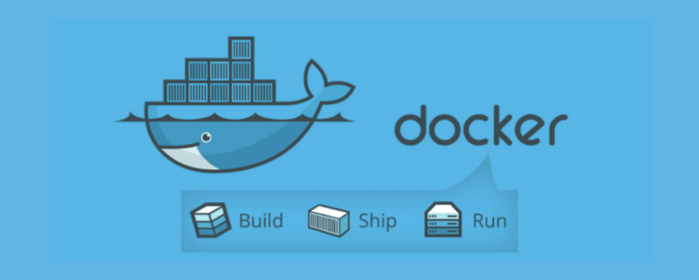

# RECETAS PARA DOCKER




.- Docker-Compose
```
.
├── MongoDb
├── React-app
└── Mysql
```


.- Dockerfile

```
.
├── apache2
└── node-api
```


## Articulos
-  [Instalación de Docker en Ubuntu, OSX, Windows](https://medium.com/javascript-nicaragua/instalando-docker-d736fe0822a8)

-  [Dockerizando SonarQube](https://medium.com/javascript-nicaragua/dockerizando-sonarqube-ae87838f6555)

-  [Dockerizando una App en reactjs](https://medium.com/javascript-nicaragua/dockerizando-una-app-en-reactjs-d3c9aef9f7bc)


## Comandos

### Images 
- `docker images ls`
- `docker images -a`
Listar imágenes

- `docker rmi Image Image`
Eliminar imágen


- `docker images -a`
Enumerar las imágenes

- `docker images -a |  grep "pattern"`
Listar las imágenes según un patrón

- `docker images -f dangling=true`
Listar imágenes pendientes

- `docker images purge`
Eliminar imágenes pendientes


- `docker images -a | grep "pattern" | awk '{print $3}' | xargs docker rmi`
Eliminar las imágenes según un patrón

- `docker container rm -f $(docker ps -aq)`
Elimina todos los contenedores


### Contenedores 
- `docker ps`
- `docker ps -a`
Listar todos los contenedores 
ß
- `docker rmi $(docker images -a -q)`
Elimina todos las imágenes 


### ELIMINAR TODO: Imágenes - Contenedores - Volúmenes - Redes 

- `docker system prune`

- `docker system prune -a`
Elimina contenedores detenidos y todas las imágenes no utilizadas
